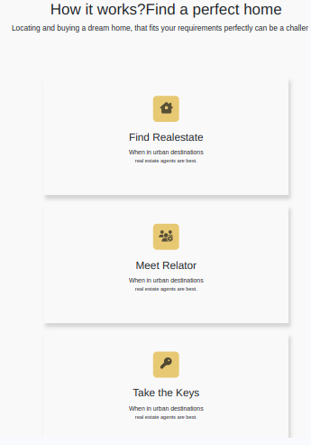

# Project Name: Royal Homes
Welcome to the Royal Homes real estate project! This project is designed to provide a visually appealing and user-friendly interface for showcasing real estate properties. The project is built using HTML and SCSS.
### Get Started
[Introduction](#introduction)
[Technologies Used](#technologies-used)
[Features](#features)
[Installation](#installation)
[Usage](#usage)
[Project Structure](#project-structure)
[Project Gallery](#project-gallery)
## Introduction:
## Technologies Used
**<li> HTML5 </li>**
**<li> CSS3</li>**
**<li> SASS</li>**
**<li> Github </li>**
**<li> Node-js</li>**
## Installation
To run this project locally, follow these steps:
1.  **Clone** **the** **repository:**
```
git clone : https://ktabassum1809.github.io/mini_project/
```
2. **Navigate to the project directory:**
```
cd mini_project
```
## Features
- **Responsive Design:** The website is fully responsive, ensuring a great user experience on all devices.
- **Property Listings:** Displays a list of properties with images, prices, and key details.
- **Property Details Page:** Provides detailed information about each property, including photos, descriptions, and contact information.
- **Search Functionality:** Users can search for properties based on different criteria.
- **Contact Form:** Allows users to send inquiries directly from the website.
## Usage
Open the `index.html` file in your web browser to view the website. You can also use a local development server for a better development experience. Here’s an example using `live-server`:
1. **Install live-server globally:**
   ```sh
   npm install -g live-server
   ```
2. **Run live-server in the project directory:**
   ```sh
   live-server
   ```
## Project Structure
Here's an overview of the project's file structure:
**mini_project/**
└───src
│index.html
| styles/ # scss files
└───main.scss
└───images/ # images & icons
│ README.md
│ package.json
| package-lock.json
## Project Gallery
This section creates a visually appealing **Gallery** to showcase various real estate projects. Each project has an **image, title, and description**, providing a comprehensive overview of the offerings by **RoyalHome Real Estate**. The responsive design ensures that the gallery looks good on different screen sizes.
### Logo of the Project:
**The Royal LuxuryHome logo is a symbol of elegance, sophistication, and quality**. It reflects our commitment to providing luxurious and high-quality real estate solutions. The logo incorporates elements that signify royalty and exclusivity, aligning with our brand values and mission.

### Form Submission in RoyalHome
#### Overview
Welcome to **RoyalHome**, your premier destination for finding the perfect property. Whether you're looking for a family house, a luxury apartment, or a cozy cottage, RoyalHome is here to help you navigate the real estate market with ease and confidence. Our platform is designed to provide a seamless and intuitive experience, making property search and acquisition as straightforward as possible.
 
#### Our Mission
At **RoyalHome**, our mission is to revolutionize the real estate industry by offering an unparalleled user experience through cutting-edge technology, modern design, and exceptional customer service. We aim to connect buyers, sellers, and renters with their ideal properties while ensuring transparency, efficiency, and satisfaction.
#### Key Features
##### Advanced Search and Filter Options
**RoyalHome** offers robust search and filtering capabilities to help you find the property that perfectly matches your criteria. Users can easily enter keywords, select property types (e.g., Family House), and apply various filters to narrow down the search results.
- **Keyword Search**: Quickly find cities and prices of the properties by entering relevant keywords.
- **Property Type Selection**: Choose from a variety of property types, including family houses, apartments, and more.
- **Filters**: Apply filters for price range, location, number of bedrooms, amenities, and more.
- **Submit Button**: Instantly see results that match your search criteria with a simple click.
### Royal Home Menu Content

#### - Home
The landing page of **Royal Home**. This page provides an overview of the platform, highlights featured properties, and showcases the latest listings.
#### - Discover Deals
At Royal Home, we bring you the best deals in the real estate market. Explore exclusive offers, special discounts, and limited-time promotions on a variety of properties. Whether you're looking for a new home, an investment opportunity, or a rental property, our curated deals will help you find the best value for your money.
#### - Find Properties
Our comprehensive property search tool allows you to find the perfect property that matches your needs. Filter and sort through our extensive listings based on location, price, property type, size, and amenities.
#### - Meet Our Experts
Our team of experienced real estate professionals is here to guide you through every step of your property journey. From finding the right property to closing the deal, our experts offer personalized advice and support.
#### - Our Designers
At Royal Home, we believe in the power of design to transform spaces. Our talented designers work closely with you to create beautiful, functional interiors that reflect your personal style. Learn more about our design team, explore their portfolios, and discover how we can help you design the home of your dreams.
#### - Contact Us
Have questions or need assistance? Our team is here to help. Reach out to us for any inquiries, support, or feedback. We value your input and are committed to providing the best customer service.
### How It Works: Find Your New Home with RoyalHome
**RoyalHome** is your trusted partner in finding the perfect home. Whether you're looking to buy or rent, our platform offers a seamless and comprehensive approach to navigating the real estate market. Here’s how you can find your **new home** with us:

### Featured Categories in RoyalHomes
RoyalHomes offers a diverse range of property types to suit every lifestyle and investment opportunity. Whether you're looking for a townhouse, modern villa, apartment, office space, or a shop house, our platform provides comprehensive listings and expert guidance to help you find the ideal property.

### Find Properties in Your Desired Cities with RoyalHom
RoyalHome offers a wide selection of properties across various cities, catering to diverse preferences and lifestyles. Whether you're looking for a home, an investment property, or commercial space, discover what each city has to offer with our comprehensive listings and expert guidance.

### Discover Our Best Deals at RoyalHome
At RoyalHome, we curate the best deals in real estate to help you find exceptional properties at competitive prices. Whether you're looking for discounted homes, investment opportunities with high ROI, or special promotions, explore our featured deals and seize your next real estate opportunity.

## Meet Our Team at RoyalHome
At RoyalHome, we pride ourselves on having a dedicated and talented team committed to providing exceptional service and expertise in the real estate industry.

### Why You Should Work with Us at RoyalHome
At RoyalHome, we’re more than just a real estate company—we’re a team of passionate professionals dedicated to transforming the real estate experience. Here are a few reasons why you should consider joining us:

### Royal LuxuryHome Footer
The footer of the Royal LuxuryHome website is designed to provide users with easy access to essential information and navigation options.

### Footer Elements
**Contact Information**:
- **Address**: The physical address of Royal LuxuryHome headquarters.
- **Phone Number**: A direct line to our customer service team.
- **Email Address**: For general inquiries and support.
**Social Media Icons**: Links to our social media profiles, including:
- Facebook
- Twitter
- Instagram
- LinkedIn
#### Authors
[Tabassum Khan](https://github.com/ktabassum1809/)
[Taunthong Vidyanond](https://github.com/TVATDCI)
[Ashwini Bheemireddy](https://github.com/Ashwini-Dci-student)
[Essam Almari](https://github.com/xxxDMTxxx)